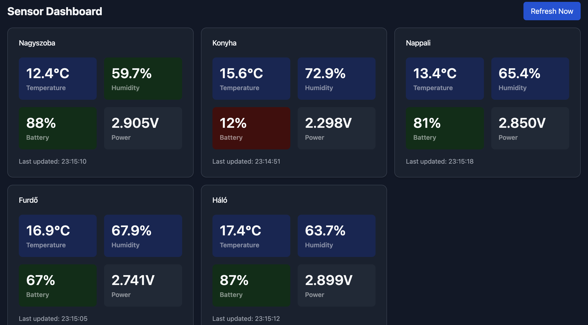

# Home Dashboard

Basic Smarthome dashboard



[LIVE demo](https://budavariam.github.io/home-dashboard/)

## Getting started

```bash
npm install
npm run dev
open https://localhost:5173/thingster/?token=xyz&user=thingeruser&bucket=mybucket&mappings=
Sensor_0:Room1;Sensor_1:Room2
```